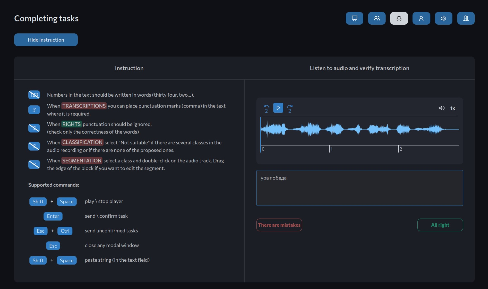

# LabelSpeech

Система для многопользовательского транскрибирования речи в аудиофайлах.



## Функционал

- Удобный интерфейс разметки с управлением горячими клавишами
- Сбор статистики о выполненных пользователями заданиях разметки
- Механизм дополнительной верификации транскрибаций 
- Настройка распределения типов заданий среди пользователей
- Темная тема 😎

## Установка, конфигурация и использование

Система разворачивается при помощи docker (в нашем случае использовалась версия 23.0.5 и docker compose версии 2.17.3) в виде 4 контейнеров:
- СУБД PostgreSQL  - хранит информацию о разметке и пользователях
- REST API для взаимодействия с базой данных
- S3 хранилище Minio - хранит аудиофайлы (возможна конфигурация с использованием стороннего хранилища)
- Nginx сервер, доставляющий веб-интерфейс

### Установка и запуск

1. Клонируем репозиторий
```
git clone <ССЫЛКА> && cd <ПАПКА>
```

2. Копируем .env.example и переименовываем его копию в .env файл. В данном файле находятся переменные окружения, предназначенные для конфигурации работы системы. В таблице ниже расположено описание каждой из переменных. Обязательными для самостоятельной конфигурации при развертывании в production-окружении являются:
	- JWT токен
	- Данные S3 хранилища 
	- Учетные данные аккаунта администратора
	- S3 токен загрузки

3. Поднимаем компоуз:
```
docker compose up -d --build
```

После первого запуска в системе будет создан аккаунт администратора с учетными данными из настроек окружения. При помощи него можно назначать права администратора другим пользователям.

### Добавление аудиозаписей на разметку

Добавление записей с речью для разметки осуществляется через HTTP-запрос к REST API приложению (доступному по порту 8000) по пути /api/file/upload. Данный запрос в качестве параметров требует токен для авторизации загрузки (который устанавливается в .env файле), аудиофайл в формате MP3 и оригинальную транскрибацию речи данного файла (может быть пустой строкой). После выполнения запроса аудиофайл загружается в S3-хранилище, а его метаинформация добавляется в базу данных.

Более подробную спецификацию метода можно посмотреть в Swagger документации по адресу http://<адрес_сервера>:8000/docs (например если сервер доступен по адресу 192.168.1.5 то документация доступна по адресу http://192.168.1.5:8000/docs)

### Переменные окружения

| Переменная              | Описание                                                                                          |
| ----------------------- | ------------------------------------------------------------------------------------------------- |
| JWT_SECRET              | JSON WEB Token для авторизации в приложении                                                       |
| JWT_ACCESS_EXPIRE       | Срок действия access токена в минутах                                                             |
| JWT_REFRESH_EXPIRE      | Срок действия refresh токена в часах                                                              |
| JWT_REFRESH_LONG_EXPIRE | Срок действия продленного refresh токена в часах                                                  |
| SERVER_ADDR             | Адрес, на котором будет разворачиваться бэкэнд приложение внутри контейнера                       |
| SERVER_PORT             | Порт, на котором будет разворачиваться бэкэнд приложение внутри контейнера                        |
| SERVER_TEST             | Режим работы uvicorn. Для dev сервера следует использовать - true, для production сервера - false |
| DB_ADDR                 | Hostname базы данных                                                                              |
| DB_PORT                 | Порт, на котором будет разворачиваться база данных                                                |
| DB_USERNAME             | Имя пользователя для работы с базой данных                                                        |
| DB_PASSWORD             | Пароль пользователя для работы с базой данных                                                     |
| DB_NAME                 | Название базы данных                                                                              |
| AWS_ACCESS_KEY_ID       | Идентификатор статического ключа, созданного при подготовке к работе c S3                         |
| AWS_SECRET_ACCESS_KEY   | Пароль для доступа к S3                                                                           |
| AWS_REGION              | Регион размещения инфраструктуры AWS                                                              |
| AWS_HOST                | URL S3 хранилища                                                                                  |
| AWS_BUCKET              | Название aws bucket для вашего S3                                                                 |
| MAX_USERS_WITH_FRAGMENT | Максимальное количество пользователей, которым может быть выдан один фрагмент для разметки        |
| ADMIN_USERNAME          | Логин от аккаунта базового администратора, который создается при первом запуске приложения        |
| ADMIN_PASSWORD          | Пароль от аккаунта администратора                                                                 |
| S3_TOKEN                | Токен для загрузки аудиозаписей в S3. Может быть произвольной строкой                                                                                                  |


